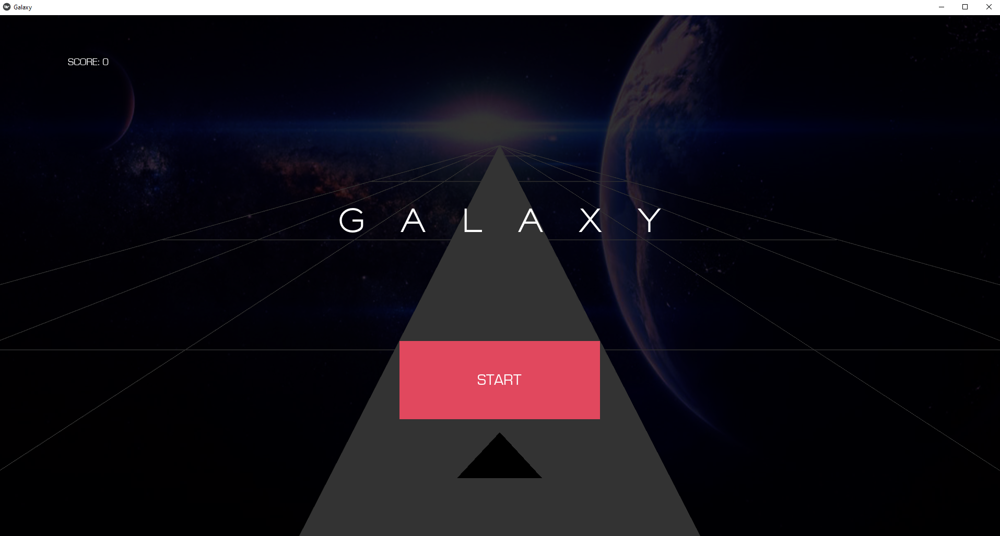
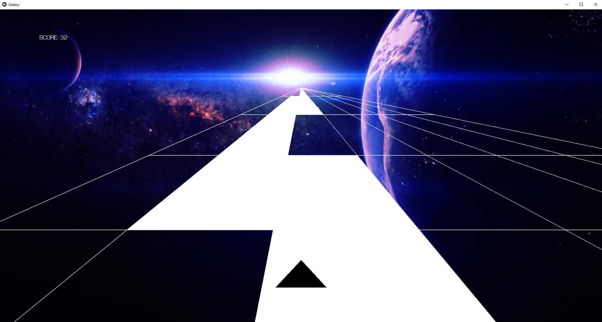

# Galaxy - Endless Runner

Welcome to **Galaxy**! This is a spaceship arcade game developed in Python using the Kivy framework.

Control a small spaceship, dodge collisions using the keyboard or mouse, and survive as long as possible. The track is procedurally generated and infinite, offering a dynamic and unique experience every time you play.

## 🚀 Installation

Follow these steps to get the game running on your machine:

**1. Prerequisites**

Make sure you have Python installed on your system. This game relies on the **Kivy** library. You can install it by running the following command in your terminal:

```bash
pip install kivy
```

**2. Running the Game**

Once Kivy is installed, navigate to the game folder and execute the `main.py` file to start the game:

```bash
python main.py
```

## 🎮 How to Play

### Controls

- **Keyboard:** Use the **Left** and **Right** arrow keys to move the spaceship.
- **Mouse / Touch:** Click and drag (or touch and slide) in the desired direction to steer the ship.

### Objective

The goal is to survive as long as possible by dodging the randomly generated obstacles. The further you go, the higher your score!



### Menu

At startup, a main menu allows you to:

- Start a new game.
- Check previous scores.
- Quit the game.

## ✨ Features

- **Infinite Gameplay:** Procedural generation creates a unique environment for every run.
- **Intuitive Controls:** Easy-to-learn inputs via keyboard or mouse.
- **Score System:** Track your performance and try to beat your high score.
- **Interactive Menu:** Simple navigation system.



## ❤️ Feedback & Support

Enjoy the game! If you have any suggestions for improvements or encounter any bugs, please feel free to open an issue or submit a pull request.

Thank you for your interest and support!
